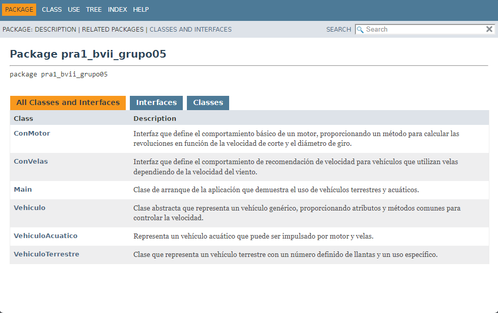

# Generación de JavaDoc
**Javadoc** es una herramienta incluida en el **JDK** (Java Development Kit) que se utiliza para generar documentación en formato **HTML** a partir de comentarios especiales en el código fuente de **Java**. Aquí se explica el proceso de como generar documentación para proyectos de aplicaciones en Java, con Javadoc. Se usará el **IDE Apache NetBeans** para tal tarea.

---

---

## Paso 1
-Abrimos nuestro proyecto con NetBeans.

-Insertamos comentarios con /** ... */ justo antes de las clases, métodos, atributos o interfaces.

## Paso 2
-Hacemos clic en la pestaña **Run** de NetBeans.

-Luego vamos a la opción **Generate Javadoc** con el nombre de nuestro proyecto y hacemos clic para generar el documento.

---

Esperamos unos instantes y ya se nos genera el documento Javadoc en formato HTML, además de que se nos abre automáticamente.

## Recomendaciones

- Verifica que tengas configurado el `JAVA_HOME` y que el proyecto esté compilado correctamente.
- Asegúrate de incluir etiquetas útiles como `@param`, `@return`, `@author`.

---
